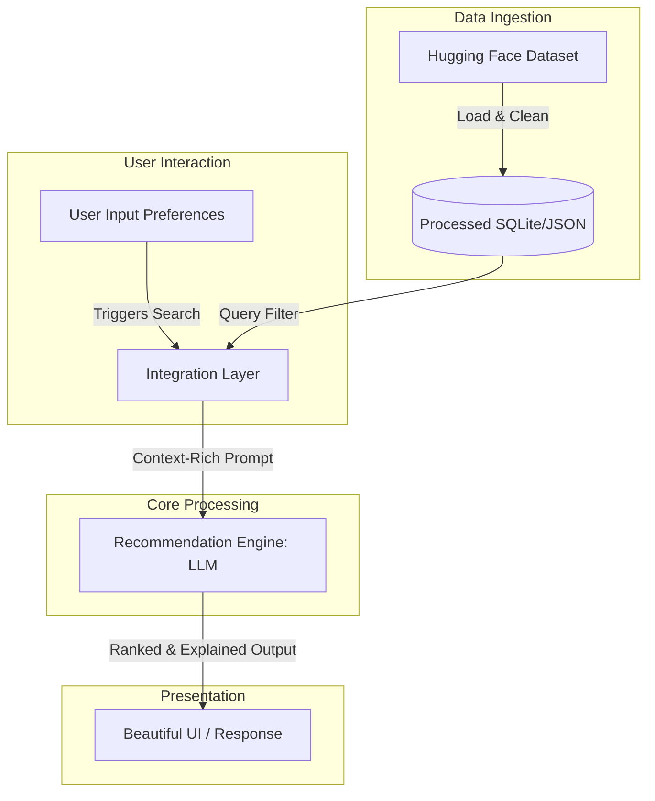

# Context: AI-Powered Restaurant Recommendation System

This document outlines the operational context, architectural layers, and data flows for the AI-Powered Restaurant Recommendation System (Zomato Use Case). The system bridges the gap between structured search and conversational discovery by combining dataset querying with generative Large Language Models (LLMs).

---

## 📖 System Context & Value Proposition

Traditional restaurant search engines rely on rigid, keyword-based filters that often fail to capture semantic nuances in user intent (e.g., *"a cozy spot for a team lunch with good vegetarian options"*). 

This system uses:
1. **Deterministic Filtering**: High-speed, rule-based matching on concrete constraints (location, cuisine, rating, budget) from a curated Zomato dataset.
2. **Cognitive Reasoning (LLM)**: Semantic parsing and ranking of filtered results to formulate conversational, tailored recommendations.

---

## 🔄 End-to-End System Workflow



### 1. Data Ingestion & Preprocessing
The underlying dataset is loaded from the Hugging Face [ManikaSaini/zomato-restaurant-recommendation](https://huggingface.co/datasets/ManikaSaini/zomato-restaurant-recommendation) repository.

During ingestion, the following core schema elements are mapped and structured:

| Dataset Field | Target Data Type | Description / Usage |
| :--- | :--- | :--- |
| `name` | String | Restaurant display name |
| `location` / `city` | String | Geographic reference for matching (e.g., Delhi, Bangalore) |
| `cuisines` | List[String] | Categorized culinary styles |
| `average_cost_for_two` | Integer | Transformed into numeric budget ranges (Low, Medium, High) |
| `aggregate_rating` | Float | Star-based rating used for threshold filtering |
| `features` / `reviews` | List[String] | Ingested to provide contextual tags (e.g., *family-friendly, quick service*) |

---

### 2. User Input Extraction
The system captures structured filters and semantic preferences:
* **Hard Constraints**: Location match, Minimum rating (e.g., `rating >= 4.0`), and Cuisine category.
* **Flexible Budgets**: Cost-for-two mapped into comparative bands:
  - **Low**: Budget-friendly dining.
  - **Medium**: Mid-range casual dining.
  - **High**: Fine dining / Premium experiences.
* **Soft Constraints**: Natural language descriptors (e.g., *"rooftop ambience"*, *"good for kids"*, *"quiet workspace"*).

---

### 3. Integration & LLM Prompting Layer
The integration layer acts as the orchestrating bridge. Rather than feeding thousands of raw dataset rows directly to the LLM—which would be cost-prohibitive and exceed context limits—the system performs a two-step process:

1. **Pre-Filtering**: Reduces the search space down to the top matching candidates (e.g., top 10–15 restaurants matching the hard location and rating constraints).
2. **Context Assembly**: Generates a dynamic prompt containing:
   * The user's specific dining constraints and desires.
   * Structured metadata of candidate restaurants.
   * Clear guidelines instructing the LLM to prioritize accuracy and prohibit hallucination.

> [!IMPORTANT]
> The prompt is engineered to enforce strict data grounding. The LLM must **only** recommend restaurants present in the provided context and cannot invent names, ratings, or cuisines.

---

### 4. Recommendation Engine (LLM)
The LLM performs three key tasks:
* **Ranking**: Compares candidate restaurants against user preferences and sorts them.
* **Semantic Analysis**: Correlates user's soft constraints (e.g., *"quick service"*) with restaurant features/reviews.
* **Natural Language Explanation**: Generates a personalized reason for *why* each restaurant fits the user's specific request.

---

### 5. Output Presentation
The final recommendations are displayed to the user in a clean, structured interface:

```json
{
  "recommendations": [
    {
      "name": "The Italian Bistro",
      "cuisine": "Italian, Continental",
      "rating": 4.5,
      "estimated_cost": "Medium (~₹1,200 for two)",
      "explanation": "Highly recommended because it offers premium pasta selections, outdoor seating matches your 'airy ambiance' request, and it fits comfortably within your medium budget."
    }
  ]
}
```
