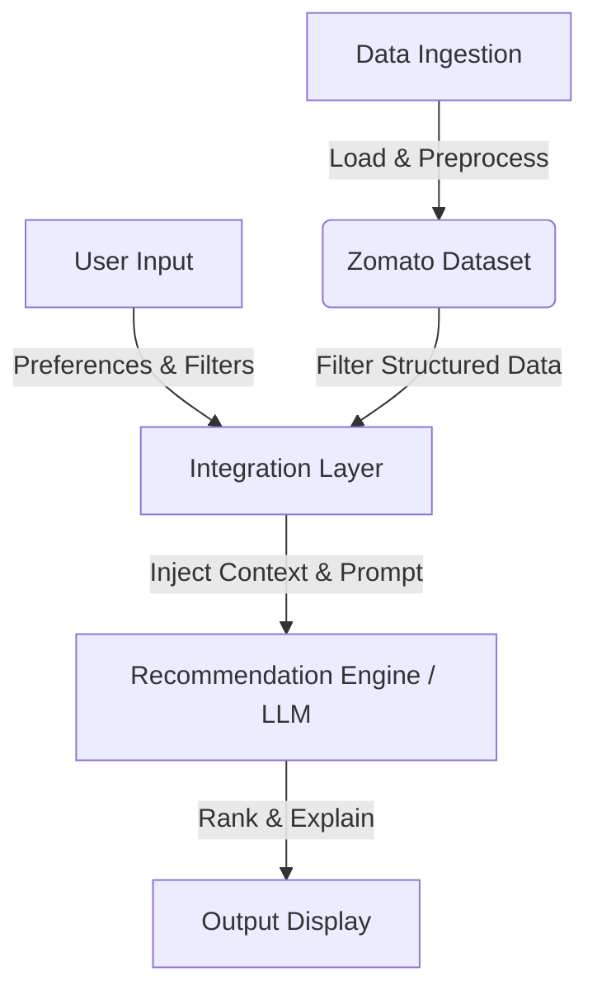

# AI-Powered Restaurant Recommendation System (Zomato Use Case)

You are tasked with building an AI-powered restaurant recommendation service inspired by Zomato. The system should intelligently suggest restaurants based on user preferences by combining structured data with a Large Language Model (LLM).

---

## 🎯 Objective

Design and implement an application that:
* **Takes user preferences** (such as location, budget, cuisine, and ratings).
* **Uses a real-world dataset** of restaurants.
* **Leverages an LLM** to generate personalized, human-like recommendations.
* **Displays clear and useful results** to the user.

---

## 🔄 System Workflow

### 1. 📥 Data Ingestion
* **Source**: Load and preprocess the Zomato dataset from Hugging Face:
  > [!NOTE]
  > Dataset Link: [ManikaSaini/zomato-restaurant-recommendation](https://huggingface.co/datasets/ManikaSaini/zomato-restaurant-recommendation)
* **Extraction**: Extract and clean relevant fields such as:
  * Restaurant Name
  * Location / Address
  * Cuisine Type(s)
  * Estimated Cost for Two
  * Average Rating
  * Highlighted Features / Reviews (if available)

### 2. 👤 User Input
Collect detailed preferences from the user to tailor recommendations:
* **Location**: Preferred dining location (e.g., *Delhi, Bangalore*).
* **Budget**: Flexible tiers (e.g., *Low, Medium, High*).
* **Cuisine**: Preferred culinary styles (e.g., *Italian, Chinese, North Indian*).
* **Minimum Rating**: Numeric threshold (e.g., *3.5+, 4.0+*).
* **Additional Preferences**: Custom tags or keywords (e.g., *family-friendly, quick service, rooftop, romantic*).

### 3. 🔌 Integration Layer
Bridge the raw structured data with the cognitive power of the LLM:
* **Filtering**: Query and filter the local or ingested dataset using structured inputs (e.g., matches for location, budget, and rating).
* **Prompt Engineering**: Construct a context-rich prompt passing down the matching candidate restaurants.
* **Reasoning Design**: Prompt the LLM to analyze, contrast, and reason over the filtered options against the user's specific context.

### 4. 🧠 Recommendation Engine
Leverage a Large Language Model (LLM) to perform the cognitive selection:
* **Ranking**: Order the matched options dynamically based on closeness to user preferences.
* **Explanations**: Provide qualitative, human-like reasons explaining *why* each restaurant fits the user's criteria.
* **Summary**: Synthesize the recommendation with an overall summary of choices.

### 5. 🖥️ Output Display
Present the final curated suggestions to the user in a highly readable format:
* **Restaurant Name**
* **Cuisine**
* **Rating**
* **Estimated Cost**
* **AI-Generated Explanation** *(Clear, conversational, and tailored to the user's exact preferences)*
